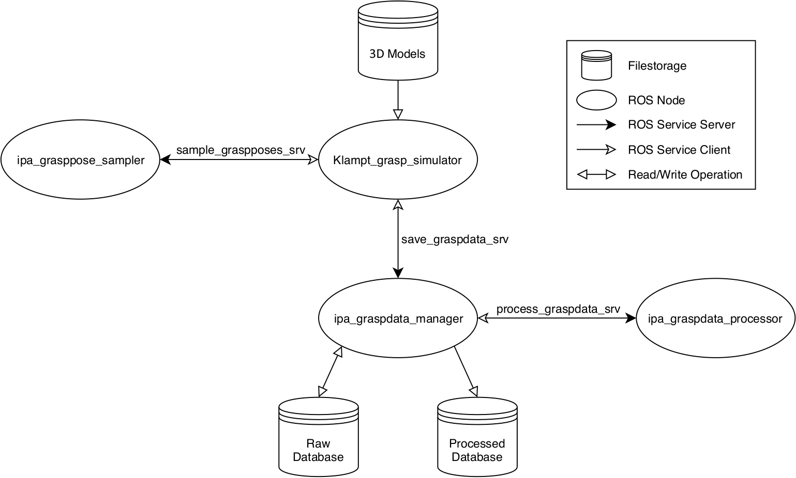

# ipa_grasp_learning_framework
This repository includes code for generating grasp poses from arbitrary objects using a robot gripper in simulation.

## Requirements
This section provides a thoughrough list of required software needed to run the ROS stack.
### General
* Ubuntu 16.04
* ROS Kinetic (full installation)
### Simulation Tool
* [Klampt 0.81 fork](https://github.com/ipa-rmb-mr/Klampt)
 Modified version of Klampt that allows removing objects from the scene
* Used IDE: Qt Creator
### Neural Network Workspace
* Python 2.7 (comes along with ROS)
* Used IDE: PyCharm Community
* pip (used version 19.1.1)
 Install and manage Python packages
* virtualenv (used version 16.6.1)
 Install virtualenv using pip, create a virtual environment and activate it:
  ```bash
  virtualenv --system-site-packages -p python2.7 ./venv
  source ./venv/bin/activate
  ```
* tensorflow-gpu (used version 1.14.0, in virtual environment)
  ```bash
  pip install tensorflow-gpu
  ```
* CUDA (used version 10.0, outside virtual environment)
 Ensure that an appropriate nvidia driver is installed (used version 415.18)
  ```bash
  # Add NVIDIA package repositories
  # Add HTTPS support for apt-key
  sudo apt-get install gnupg-curl
  wget https://developer.download.nvidia.com/compute/cuda/repos/ubuntu1604/x86_64/cuda-repo-ubuntu1604_10.0.130-1_amd64.deb
  sudo dpkg -i cuda-repo-ubuntu1604_10.0.130-1_amd64.deb
  sudo apt-key adv --fetch-keys https://developer.download.nvidia.com/compute/cuda/repos/ubuntu1604/x86_64/7fa2af80.pub
  sudo apt-get update
  wget http://developer.download.nvidia.com/compute/machine-learning/repos/ubuntu1604/x86_64/nvidia-machine-learning-repo-ubuntu1604_1.0.0-1_amd64.deb
  sudo apt install ./nvidia-machine-learning-repo-ubuntu1604_1.0.0-1_amd64.deb
  sudo apt-get update

  # Install development and runtime libraries (~4GB)
  sudo apt-get install --no-install-recommends \
    cuda-toolkit-10-0 \
    libcudnn7=7.4.1.5-1+cuda10.0  \
    libcudnn7-dev=7.4.1.5-1+cuda10.0
  ```
* h5py (used version 2.9.0, in virtual environment)
* matplotlib (used version 2.2.4, in virtual environment)
* Keras (used version 2.2.4, came with scipy version 1.2.2, in virtual environment)
* scikit-learn (used version 0.20.4, in virtual environment)
* scikit-plot (used version 0.3.7, in virtual environment)
* Install pandas (used version 0.24.2, in virtual environment)

## Data Generation
The _Klampt_grasp_simulator_ package holds a grasp simulation based on a Klampt 0.81 fork (see above).



The ROS node diagram depicts each ROS node, whereof the _Klampt_grasp_simulator_ node denotes the central part of the data generation. This simulation tool loads the object models, one at a time, into the simulation and calls a ROS service named _sample_graspposes_srv_ provided by the _ipa_grasppose_sampler_ node. This service triggers the _ipa_grasppose_sampler_ to generate grasp candidates for the given point cloud and returns them to the simulation. After having tested all grasp candidates, the simulation provides the results to the _save_graspdata_srv_ service given by the _ipa_graspdata_manager_ node which saves it to a raw database on the drive. Finally, after collecting the raw data from simulation, the _ipa_graspdata_manager_ can be executed separately to first load the raw data, then process and store it to a new database which holds the final samples for the neural network afterwards. Hereby, the manager node makes use of the _process_graspdata_srv_ service offered by the _ipa_graspdata_processor_ node which actually performs the processing of the raw data. Finally, the processed data is passed over to the manager node that takes care about the storing of the received data. Note: The KIT models are not included in this repository as of yet.

The simulation along with all other relevant nodes to generate grasp data can be started using:

>roslaunch Klampt_grasp_simulator simulator.launch

Moreover, further simulation processes can be started to, for example, speed up the data gathering using by assigning each simulation process a different share of the _graspable_objects_ list. There is another launch file for a second simulator process, but as many as wanted can be created by setting up further launch files and associated config files. Take into account that the second simulator cannot be started without the first simulator launch file having priorly been started.

>roslaunch Klampt_grasp_simulator simulator2.launch

These launch-files just start further simulation nodes and use the existent nodes to generate grasp candidates and save the data to the drive (_~/.ros_ defines the main storage folder).

After having created the raw database containing depth images and evaluated grasp candidates, the data has to be processed into a format the neural network can learn from. This procedure can be initiated by executing:

>roslaunch ipa_graspdata_manager graspdata_manager_offline.launch

After processing the data, the samples of each object are sorted by their rating. The positive grasp candidates reside in the _good_ folder, whereas the negative ones are inside the _bad_ folder.

## Defining data splits
The test data has to be manually moved out of the processed data into a designated folder for test data.
However, the data meant for setting up the neural network can be divided into training and validation data using:

>python ipa_grasppose_dnn/scripts/ipa_create_validation_dataset

This script extracts a tweakable percentage of the available data and moves it into a new folder meant for validation data.

## Training of the CNN
The training process of the provided CNN is initiated with the following script:

>python ipa_grasppose_dnn/scripts/ipa_train_grasp_dnn

This script offers parameters to adjust the training process such as the _learning rate_ and the _batch size_.
The resulting models of the training process are saved to _~/.ros/models_.

The results of the training process can be visualized using the _ipa_process_results_ script.

## Inference of the CNN
The code for inference is experimental and not tested well. The node to perform predictions can be started within the virtual environment of the neural network workspace:

>roslaunch ipa_grasppose_dnn predict_graspquality.launch

Hereby, the node offers a service that can be used for performing predictions on handed over raw data.

An example to demonstrate the prediction code can be started using:

>roslaunch Klampt_grasp_simulator simulator_predict.launch

Before launching the simulator, the code snippet responsible to perform predictions inside _Klampt_grasp_simulator/ros/src/simulation_backend.cpp_ in _SimulationBackend::callSaveGraspdataService()_ has to be uncommented and compiled. Now, instead of saving the gathered data to the drive, it is fed to the neural network.

## Klamp't Object Models
In order to be able to load a 3D model into the simulation, it first has to be converted into the _obj_ file format Klamp't works with. The file format consists of a reference to an _off_ file that contains the geometrical data of the object and the physical parameters. Inside _Klampt_grasp_simulator/other_ there are two bash-scripts to facilitate the conversion process. Hereby, the _model_converter.sh_ can be configured to convert models to the _off_ format utilizing the _ctmconv_ command which is part of [OpenCTM](https://github.com/Danny02/OpenCTM). Furthermore, the converted models can be wrapped into the Klamp't format using the second bash-script _off_to_Klampt_obj.sh_ which assigns standard physical properties to all models. Take into account that the script files need to be made executable beforehand:

>chmod +x <fileName>

## Custom Grippers
Aside from the provided gripper of the Care-O-bot 4, further grippers can be integrated into the simulation. To achieve that, first, the model of the gripper and its kinematic have to be defined. This happens in the _rob_ file of Klamp't. Hereby, Klamp't offers a tool called _URDFtoRob_ to convert _urdf_ files into _rob_ files. The ability of the gripper to freely float in the simulation is achieved by attaching a floating base to the first link of the gripper. Such a floating base is provided in _Klampt_grasp_simulator/data/grippers/gripper_floating_base.rob_. More information about how to set up a robot in the _rob_ format can be found [here](http://motion.pratt.duke.edu/klampt/pyklampt_docs/Manual-FileTypes.html#robot-rob-files) and [here](https://github.com/krishauser/Klampt/blob/master/Cpp/docs/Tutorials/Import-and-calibrate-urdf.md).

After defining the kinematics of the gripper in the Klamp't compatible format, the functionality of the gripper needed for the grasp simulation has to be implemented in C++. Thereby, the _GripperInterfaceBase_ class (resides in _Klampt_grasp_simulator/ros/include_) has to be subclassed and the necessary methods have to be implemented with the gripper-specific behavior. Furthermore, the _GripperInterfaceBase::createGripperInterfaceByName_ method of the base class has to be extended with a new unique string for the new gripper type. This string can then be assigned to the _gripper_interface_name_ parameter within _Klampt_grasp_simulator/ros/launch/gripper_settings.yaml_.

## Paper
At ISR 2020 conference, a paper was published detailing the concept behind this implementation of the grasp learning framework.
https://ieeexplore.ieee.org/document/9307474

## Licenses
The software stack is licensed under both the GNU GPL version 3 and GNU LGPL version 3 licenses. At your option, any later version of these licenses are applicable as well.

* ipa_graspdata_manager: LGPL
* ipa_graspdata_processor: LGPL
* ipa_grasppose_dnn: GPL
* ipa_grasppose_sampler: LGPL
* ipa_grasppose_srvs: LGPL
* Klampt_grasp_simulator: GPL

